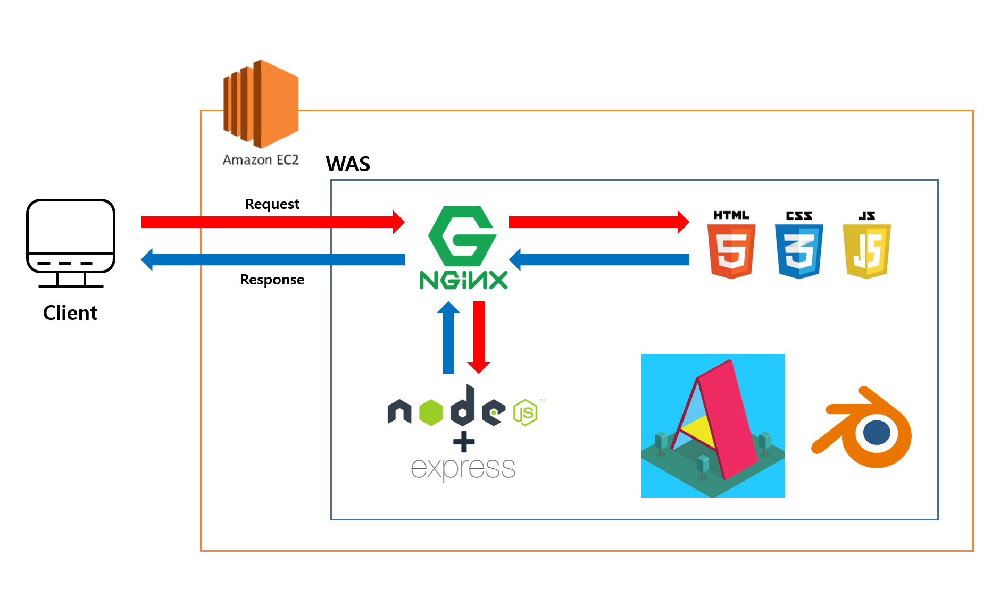
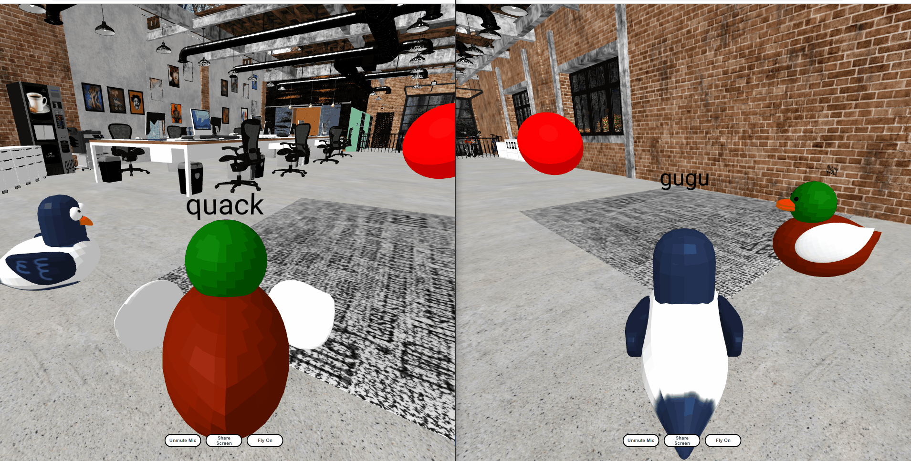

<div align="center">
    <h1>
        In Ssa Hub
    </h1>
    <h5> 🦆 3D모델링 🦆 </h5>
    
    <h5> 👀 Front-End 👀 </h5>
    
    <h5> 💻 Back-End 💻 </h5>
    
    <h5> 📢 Collaboration 📢 </h5>
       
</div>

<br />

<br />

## 📑 목차

1. 서비스 소개
2. 코드 실행 방법
3. 기술 스택 및 개발 환경
   1. 서비스 아키텍처
   2. Git Policy
4. 구현 기능
5. 팀원 소개

<br />

<br />

## 1. 서비스 소개

온라인의 한계로 생각했던 현장성의 결여를 메타버스 환경을 통해 자신만의 장소나 집안에서 경험할 수 있도록 한 **"사내 임직원들을 위한 메타버스 동호회 서비스"**입니다.

실제 메타버스 세계에서는 다양한 아바타로 N명의 사용자가 같이 활동하나, "InSsaHub"에서는 2명의 사용자가 음성, 각 아바타의 애니메이션, 화면 공유 등을 통해 서로 소통할 수 있는 환경을 제공합니다.

#### 배경

👉 코로나 19 사태로 갑작스러운 비대면 시대를 맞게 되며 메타버스에 대한 관심이 급증하고, 이에 따라 자신만의 장소나 집안에서 경험할 수 있는 새로운 시도들이 생겨나고 있음

👉 온라인의 한계로 생각했던 현장성의 결여를 메타버스를 통해 새로운 시도의 장을 열어 가고자 메타버스 세계의 기초인 아바타 구현을 해보고자 함

#### 목표

👉 2명의 사용자가 서로 소통할 수 있는 환경 구현

👉 음성을 통해 실시간으로 소통하고, 아바타 거리에 따른 음성 송출 음량을 조절함으로써 실제 세계와 유사한 환경 구현

👉 키보드(WASD)를 이용하여 각 사용자의 아바타가 움직일 수 있으며, 이를 상대방 사용자가 확인 가능

👉 사용자의 아바타의 특정 상태에 따른 애니메이션 구현

<br /><br />

## 2. 코드 실행 방법

#### Download

```bash
git clone https://lab.ssafy.com/s06-final/S06P31S103.git
```

#### Install

```bash
cd client
npm i
npm start
```

<br />

<br />

## 3. 기술 스택 및 개발 환경

#### 🧱 서비스 아키텍쳐



#### 📮 Git Policy

```bash
Commit message Rule
- 태그의 첫 문자는 대문자로 작성
- 명시된 태그 타입 이외에는 사용 금지
```

| TAG      | Description                   | Example                        |
| -------- | ----------------------------- | ------------------------------ |
| Feat     | 기능 관련 추가/수정하는 경우  | 로그인 기능 추가               |
| Fix      | 버그수정                      | 버그 수정 (FE BE 매치 실패)    |
| Design   | CSS 등 사용자 UI 디자인 변경  | 버튼 UI 변경                   |
| Docs     | 문서를 수정한 경우            | README 수정                    |
| Refactor | 코드 리팩터링할 경우          |                                |
| Merge    | 상위 브랜치로 Merge 하는 경우 | merge from release into master |

<br />

<br />

## 4. 구현 기능

#### 1️⃣ Landing Page


#### 2️⃣ 아바타 선택 Modal


#### 3️⃣ 상호작용


#### 4️⃣ nav-mesh


#### 5️⃣ 마이크 On / Off



#### 6️⃣ 비행 모드 & Fly Animation


#### 7️⃣ 화면 공유


<br />

<br />

## 5. 팀원 소개

| 팀원   | 역할                         | Gitlab         |
| ------ | ---------------------------- | -------------- |
| 김승수 | 팀장 (Backend, DevOps)       | supermen703    |
| 김수용 | 팀원 (Backend)               | kst2575        |
| 이가은 | 팀원 (Frontend)              | rkdms0116      |
| 이소영 | 팀원 (Frontend, 3D Modeling) | th42500        |
| 한채은 | 팀원 (Frontend)              | onehousesilver |

